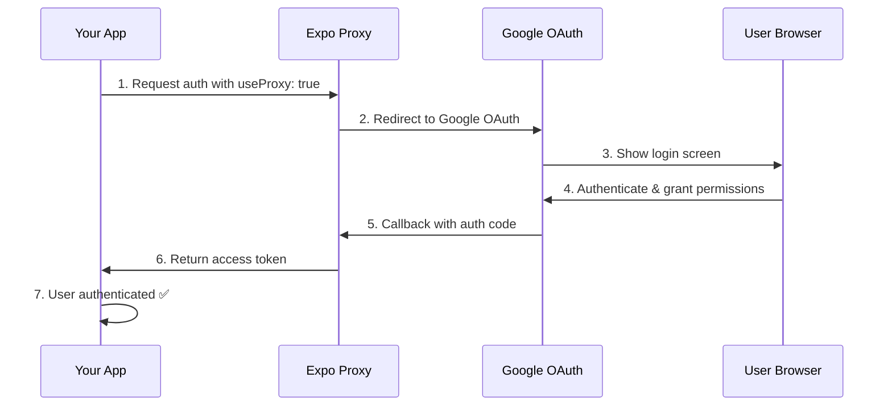

# Testing Google Auth with Expo Proxy

This guide helps you quickly test Google authentication using Expo's authentication proxy.

## Quick Start (5 minutes)

### 1. Add Redirect URI to Google Cloud Console

This is the **most critical step**:

1. Go to [Google Cloud Console](https://console.cloud.google.com/apis/credentials)
2. Select your Firebase project
3. Click on your **Web application** OAuth client
4. Under "Authorized redirect URIs", add:
   ```
   https://auth.expo.io/@moviestracker/mobile
   ```
5. Click **Save**

### 2. Get Your Web Client ID

1. Copy the **Client ID** from the same OAuth client
2. It looks like: `123456789-abc123.apps.googleusercontent.com`

### 3. Set Environment Variables

Create `mobile/.env`:

```env
# Minimum required for proxy testing (use same Web Client ID for all)
EXPO_PUBLIC_GOOGLE_WEB_CLIENT_ID=your-web-client-id.apps.googleusercontent.com
EXPO_PUBLIC_GOOGLE_IOS_CLIENT_ID=your-web-client-id.apps.googleusercontent.com
EXPO_PUBLIC_GOOGLE_ANDROID_CLIENT_ID=your-web-client-id.apps.googleusercontent.com

# Firebase (optional for basic OAuth testing)
EXPO_PUBLIC_FIREBASE_API_KEY=your-api-key
EXPO_PUBLIC_FIREBASE_AUTH_DOMAIN=your-project.firebaseapp.com
EXPO_PUBLIC_FIREBASE_PROJECT_ID=your-project-id
EXPO_PUBLIC_FIREBASE_APP_ID=your-app-id
```

**Note:** For proxy testing, you can use the same Web Client ID for all three variables initially. Platform-specific IDs are only needed for production builds.

### 4. Start the App

```bash
cd mobile
npm start
```

### 5. Test with Expo Go

1. Scan QR code with Expo Go app (iOS/Android) or Camera app (iOS)
2. Tap "Sign in with Google"
3. Browser will open → Select your Google account
4. Grant permissions → Redirects back to app
5. You should be logged in! ✅

## How It Works



## Key Configuration Points

### In AuthContext.tsx
```typescript
const [request, response, promptAsync] = Google.useAuthRequest(
  {
    expoClientId: process.env.EXPO_PUBLIC_GOOGLE_WEB_CLIENT_ID,
    // ... other IDs
  },
  {
    useProxy: true, // ← This enables Expo proxy
    projectNameForProxy: '@moviestracker/mobile', // ← Must match redirect URI
  }
);
```

### In Google Cloud Console
- **Redirect URI must be:** `https://auth.expo.io/@moviestracker/mobile`
- **Client type:** Web application
- **JavaScript origins:** Not required for proxy

### In app.json
- **Scheme:** `movies` (for deep linking after auth)
- **Slug:** `movies-mobile` (matches proxy project name)

## Debugging Tips

### Check the auth response
Add this to AuthContext to see what's happening:

```typescript
useEffect(() => {
  console.log('Google Auth Response:', JSON.stringify(response, null, 2));
  if (response?.type === 'success') {
    console.log('Access Token:', response.authentication?.accessToken);
  }
}, [response]);
```

### Common Issues

| Issue | Solution |
|-------|----------|
| "Invalid redirect URI" | Add `https://auth.expo.io/@moviestracker/mobile` to Google Console |
| "No client ID found" | Check `.env` file exists and has `EXPO_PUBLIC_GOOGLE_WEB_CLIENT_ID` |
| Variables not loading | Restart Metro: `npm start -- --reset-cache` |
| Browser doesn't redirect | Check `scheme: "movies"` in app.json |
| "Error 10" (Android) | For Expo Go, it's likely a redirect URI issue, not SHA-1 |

### Test Without Firebase

If you just want to test Google OAuth (without Firebase integration), you can:

1. Comment out Firebase imports in AuthContext
2. Just log the access token and user info
3. Focus on getting the OAuth flow working first

Example minimal test:

```typescript
useEffect(() => {
  if (response?.type === 'success') {
    console.log('✅ OAuth Success!', response.authentication?.accessToken);
  }
}, [response]);
```

## Next Steps

Once proxy testing works:

1. ✅ Get platform-specific client IDs for production
2. ✅ Add additional redirect URIs for standalone builds
3. ✅ Test on physical devices
4. ✅ Set up Firebase integration
5. ✅ Build standalone apps with EAS Build

## Why Use the Proxy?

Google's OAuth 2.0 has strict requirements:
- ❌ Custom schemes like `exp://` are not allowed
- ❌ Localhost redirects don't work on mobile
- ✅ HTTPS URLs with registered domains are required
- ✅ Expo proxy provides a stable HTTPS endpoint

This makes it **perfect for development and testing**!

## Production Considerations

For production (standalone builds):
- Add platform-specific redirect URIs
- Use EAS Build for proper signing
- Test on actual devices before release
- Consider using Firebase Auth URLs as additional redirects

But for **development and testing**, the Expo proxy is the fastest and easiest approach! 🚀
